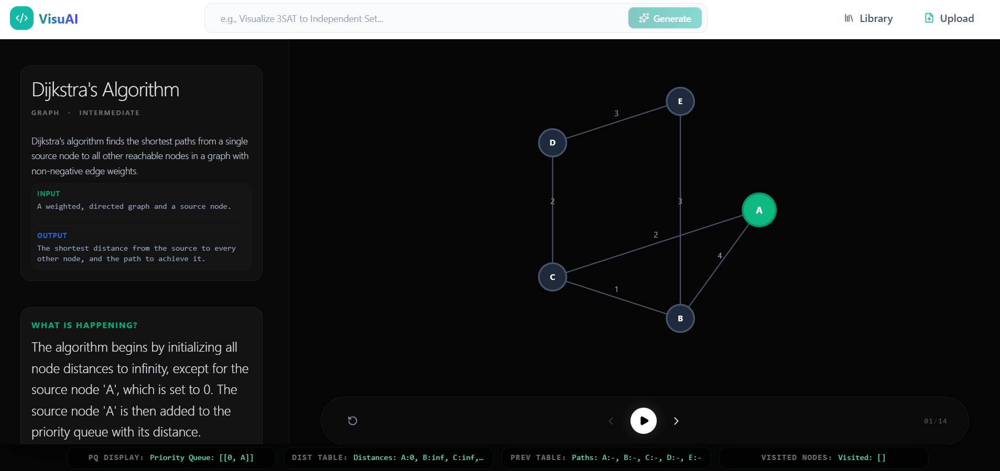
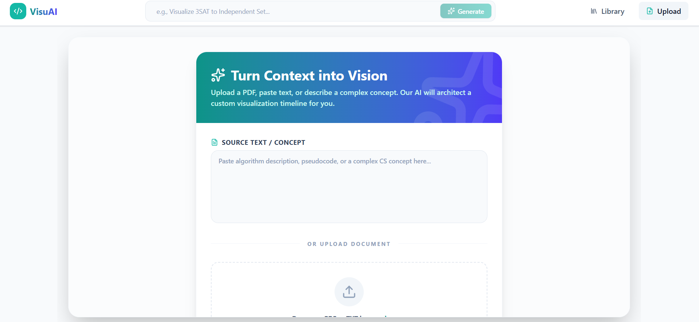

### An Algorithm Visual AI Generator
Still ongoing project. Powered by Gemini.

# Summary
"A picture is worth a thousand words" (F.R Barnard), therefore - insead of reading thousands of words - just watch the algorithm visualization.

# Main Features
- Generating by prompt
- Generating by PDF (RAG)

# Main Implement Idea
To provide a general solution for representing all algorithms in a uniform way, a common pattern is defined that every algorithm object follows.
When a user requests an algorithm, Gemini generates an object that conforms to this pattern.

